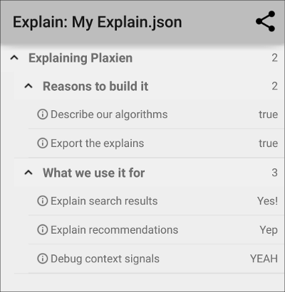
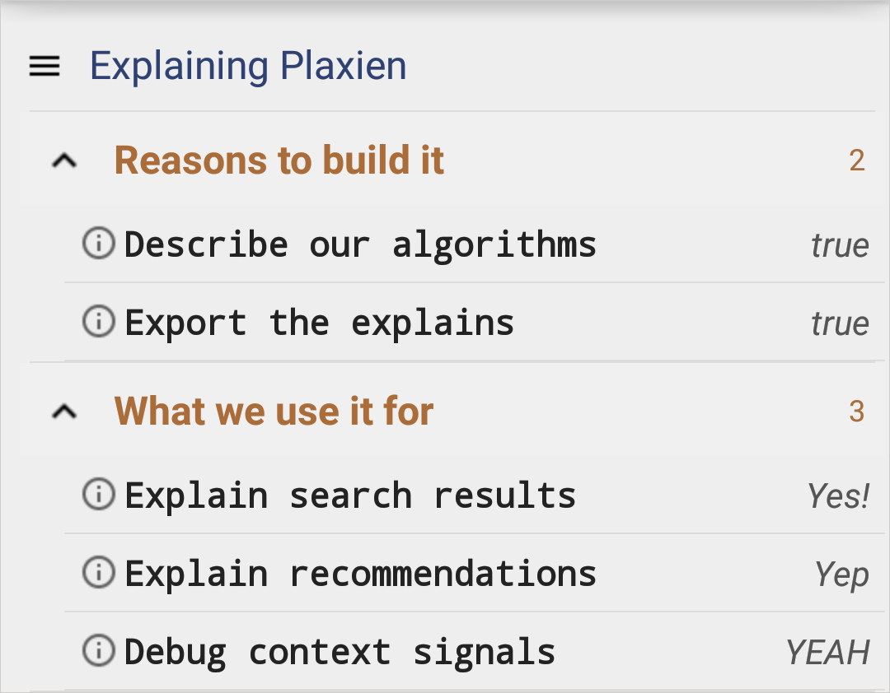

# Plaxien
## Let Your App Explain Itself Beautifully

Plaxien is a small library we use at EverythingMe, that allows us to create "Explains" - easy to read representations of in-app data and logic.

Basically it can represent hierarchical data composed of "nodes" and "key/value" pairs in a nice collapsible tree view. It looks something like this:



## Why did we create Plaxien?

The idea is simple - you want to be able to peek into your app's internal logic beyond logs.
It could be anything - why did a search result return? What's the metadata of the current user? etc.

That's why in debug builds of our app, we add Explain Views for different parts of our system (Smart Folders, Contextual Insights, App Recommendations, In-phone search, etc).
Over the years different features in our product had solved this ad-hoc using a number of techniques,
but we wanted a simple, unified way to create those views.

Plaxien allows us to quickly create them, export the explain data to the servers, and even create these trees from arbitrary JSON trees.

## Example usage

The basic idea is that you build a tree of "Explain Nodes", that can have sub-nodes, or values - which are nodes with a key and a value.

Then you can either embed an `ExplainView` right in any activity, or launch an activity.

```java

        // First we create the root of the tree
        Explain.Node node = new Explain.Node("Explaining Plaxien", null);

        // Now we can add sub-nodes.
        node.addChild("Reasons to build it")
                // To sub nodes we can add values
                .addValue("Describe our algorithms", true)

                // Adding a Uri or intent to a value launches them when the value is clicked
                .addValue("Export the explains", true, "http://everything.me");

        // Repeat as much as you want and as deep as you want
        node.addChild("What we use it for")
                .addValue("Explain search results", "Yes!")
                .addValue("Explain recommendations", "Yep")
                .addValue("Debug context signals", "YEAH");


        // This is how you launch the activity shown in the image above
        ExplainActivity.explain(this, "My Explain", node, true);

        // Alternatively - this is how you embed the explain view in an activity
        ExplainViewFactory f = new ExplainViewFactory(this);
        someContainerView.addView(f.getSectionView(node));


```


## Adding Plaxien to your App

In Android Studio - just clone this project, import it into Android Studio, and add it as a dependency to your app.


## Styling

It is possible to customize and apply your own style theme to the texts.

#### Options
Styles you can extend:
* `PlaxienTitle` - the title text style of all nodes and values
* `PlaxienNodeName` - the node name text style
* `PlaxienNodeCounter` - the node counter text style
* `PlaxienValueName` - the value name text style
* `PlaxienValue` - the value text style

#### Usage

##### 1. Define `<style>`
Define in your project new `style` for node title and change to other color for example:

``` xml
<style name="MyPlaxienTitle" parent="PlaxienTitle">
        <item name="android:textColor">#2E4172</item>
</style>
```

Do it for other styles if you want.

##### 2. Apply styles

``` java
// Create new view style with your super new theme
ExplainViewFactory.ExplainViewStyle viewStyle = new ExplainViewFactory.Builder()
        .setTitleStyle(R.style.MyPlaxienTitle)
        .setNodeNameStyle(R.style.MyPlaxienNodeName)
        .setNodeCounterStyle(R.style.MyPlaxienNodeCounter)
        .setValueNameStyle(R.style.MyPlaxienValueName)
        .setValueStyle(R.style.MyPlaxienValue)
        .build();

// Create view factory as before! just pass the viewStyle
ExplainViewFactory f = new ExplainViewFactory(this, viewStyle);

```

##### Theme example


